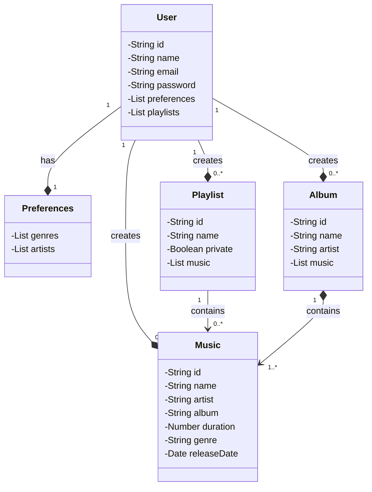

# Santander Dev Week 2023 Java API
Neste projeto, desenvolvi uma API REST utilizando Java, Spring Boot e Railway para criar um sistema de reprodutor de músicas. Diferente de plataformas estabelecidas como o Spotify, esta aplicação permite que qualquer usuário publique suas músicas, tornando a plataforma mais aberta e acessível. O projeto foi idealizado para oferecer uma experiência de uso intuitiva e flexível para a publicação e reprodução de músicas.

Objetivo da Contribuição:

A missão foi implementar uma API REST que permitisse a interação com um reprodutor de músicas, incluindo funcionalidades para publicação e reprodução de músicas por qualquer usuário. A API foi desenvolvida com foco em simplicidade e escalabilidade, utilizando tecnologias modernas para garantir um desempenho eficiente e uma boa experiência do usuário.

Detalhes da Implementação:

Desenvolvimento da API REST:

Tecnologias Utilizadas: A API foi construída com Java e Spring Boot, aproveitando a robustez e a flexibilidade desses frameworks para criar um backend eficiente e escalável. Utilizei o Railway para o deployment, garantindo que a API estivesse acessível online e funcionando corretamente.
Endpoints Principais: Implementei endpoints para criar, listar, atualizar e excluir músicas, bem como para que os usuários possam interagir com o sistema, publicando suas músicas e acessando o reprodutor.
Funcionalidades do Reprodutor de Músicas:

Publicação de Músicas: A aplicação permite que qualquer usuário publique suas músicas na plataforma. Implementando controle de acesso e validação para garantir que as músicas sejam adicionadas corretamente.

Reprodução e Listagem: Desenvolvi funcionalidades para que os usuários possam reproduzir músicas e visualizar listas de músicas disponíveis, proporcionando uma experiência de uso semelhante a outras plataformas de streaming.

Arquitetura e Design:
Estrutura do Projeto: O projeto foi estruturado de acordo com as melhores práticas de desenvolvimento de APIs REST, utilizando uma arquitetura limpa e modular para facilitar a manutenção e a escalabilidade.
Documentação da API: Criei documentação clara para os endpoints da API, facilitando o entendimento e a integração com outros sistemas ou aplicações.
Deployment e Acesso:

Utilização do Railway: O projeto foi publicado utilizando Railway, o que permite fácil acesso e gerenciamento da API na nuvem. Isso garantiu que a API estivesse disponível para testes e uso em um ambiente real.
Repositório e Processo:

Criação do Repositório: Um repositório foi criado no GitHub para hospedar o código-fonte da API REST. Isso facilita o acesso ao código e a colaboração futura.
Desenvolvimento e Documentação: Trabalhei na implementação do código com foco na clareza e na documentação. Comentários foram adicionados para descrever a lógica e as funcionalidades da API.
URL do Repositório: O link para o repositório contendo o código da API REST está incluído na entrega do projeto.
Referências e Materiais de Apoio:

Recursos Adicionais: Usei recursos e tutoriais disponíveis online para garantir a implementação correta das funcionalidades e para o deployment com Railway.
Conclusão:

Este projeto de API REST para um reprodutor de músicas é um exemplo da aplicação prática de tecnologias modernas para criar uma solução escalável e acessível. Ao permitir que qualquer usuário publique suas músicas, a plataforma oferece uma abordagem mais aberta e inclusiva para a reprodução de músicas. Estou satisfeito com o resultado e ansioso para aplicar esses conhecimentos em projetos futuros!
RESTful API da Santander Dev Week 2023 construída em Java 17 com Spring Boot 3.

## Principais Tecnologias
 - **Java 17**: Utilizaremos a versão LTS mais recente do Java para tirar vantagem das últimas inovações que essa linguagem robusta e amplamente utilizada oferece;
 - **Spring Boot 3**: Trabalharemos com a mais nova versão do Spring Boot, que maximiza a produtividade do desenvolvedor por meio de sua poderosa premissa de autoconfiguração;
 - **Spring Data JPA**: Exploraremos como essa ferramenta pode simplificar nossa camada de acesso aos dados, facilitando a integração com bancos de dados SQL;
 - **OpenAPI (Swagger)**: Vamos criar uma documentação de API eficaz e fácil de entender usando a OpenAPI (Swagger), perfeitamente alinhada com a alta produtividade que o Spring Boot oferece;
 - **Railway**: facilita o deploy e monitoramento de nossas soluções na nuvem, além de oferecer diversos bancos de dados como serviço e pipelines de CI/CD.

## Diagrama de Classes (Domínio da API)

